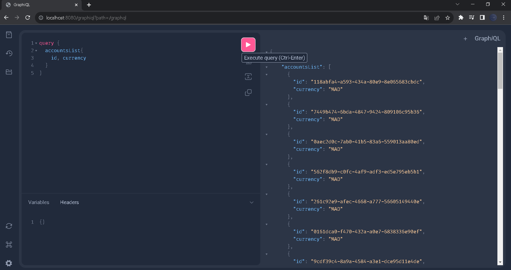
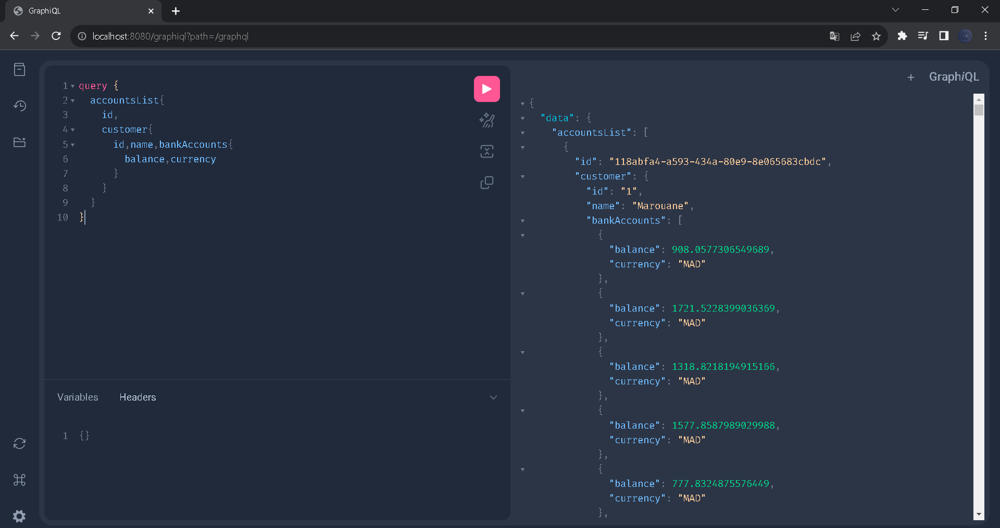
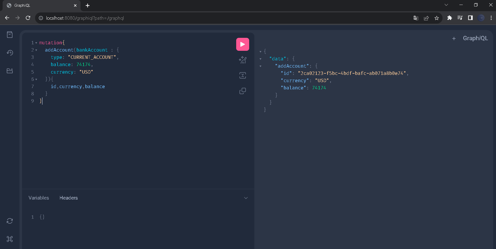
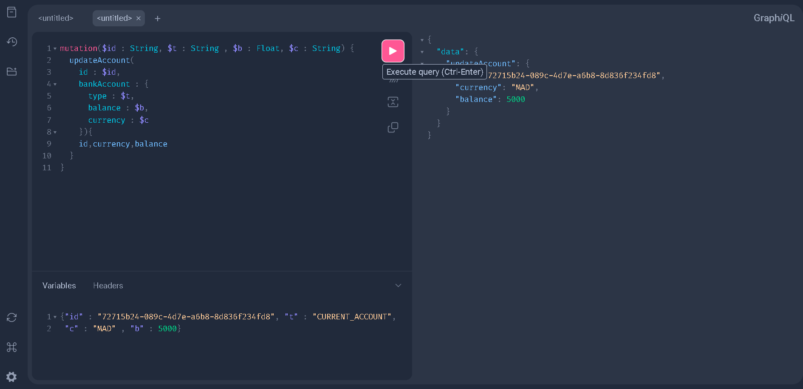
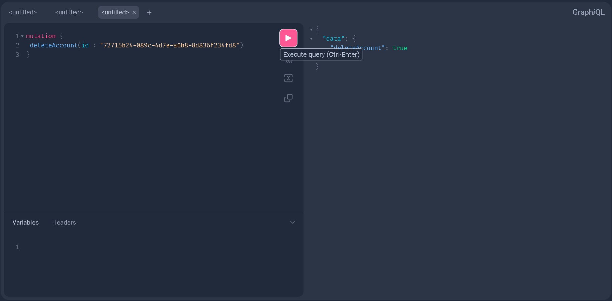
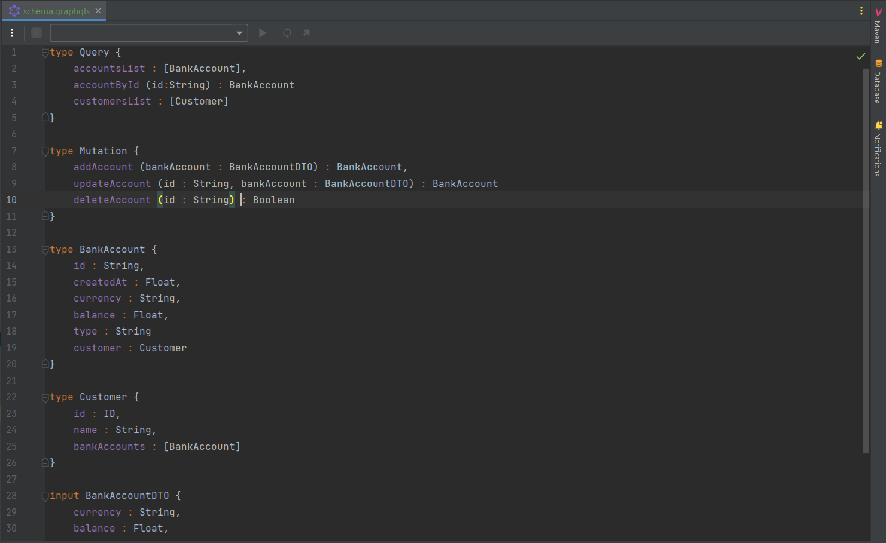
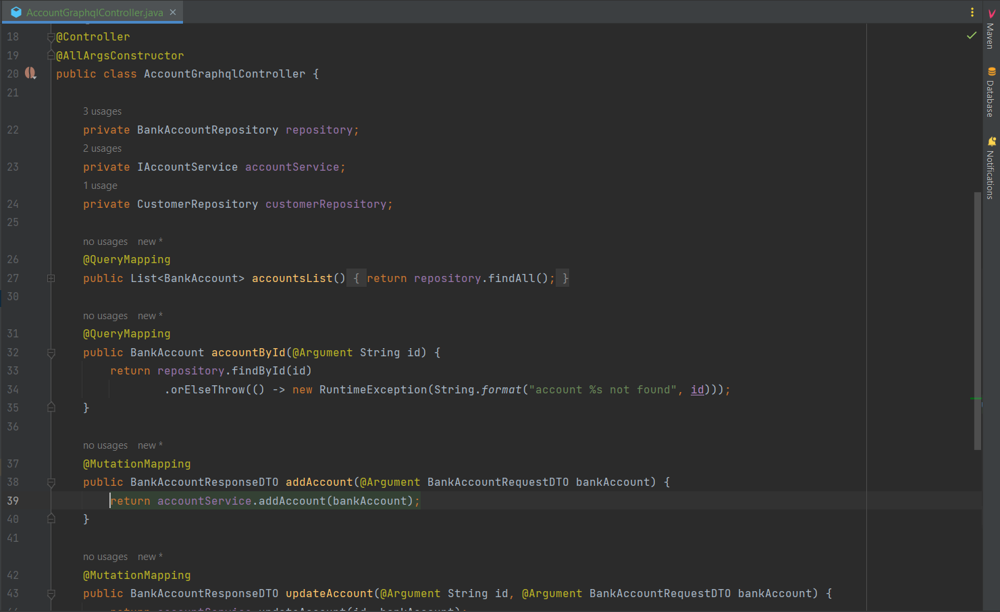

<h1><center>Bank Account Service</center></h1>

<hr>

<br>
<center>Microservice qui permet des gérer des comptes bancaires :</center>
<br>
<hr>

### 1. pour "Query"

La liste des comptes bancaires:



Les informations du client et les comptes bancaires:




### 2. pour "Mutation"

La création du compte:





La modification du compte:





La suppression du compte:




<hr>

<br>

Pour GraphQL:

1- La dependance:
```markdown
<dependency>
<groupId>org.springframework.boot</groupId>
<artifactId>spring-boot-starter-graphql</artifactId>
</dependency>
```

pour activer graphiql dans le projet on doit specifier sur "application.properties" :
```markdown
spring.graphql.graphiql.enabled=true
```
Schema GraphQL :





le schema represente query, mutation et les models qu'on a utiliser "BankAccount", "Customer"

